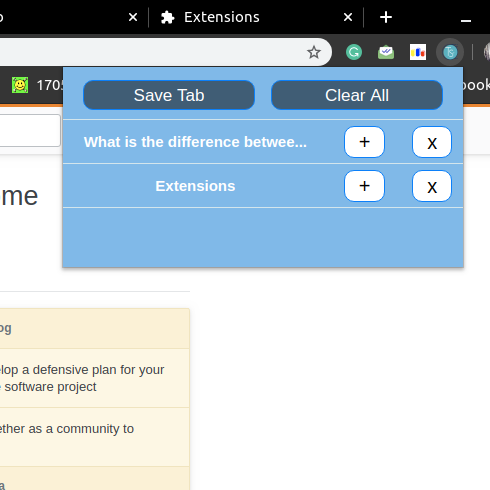

# TabSaver
This Chrome extension can save Tabs & Restore them later.

## Steps to install
1- Download TabSaver.crx file from this link: https://bit.ly/TabSaver2.
2- Go to Chrome Setting -> More Tools ->Extensions.
3- Enable Developer Mode from Top Right
4- Drag the TabSaver.crx file there to install it.

## Images
